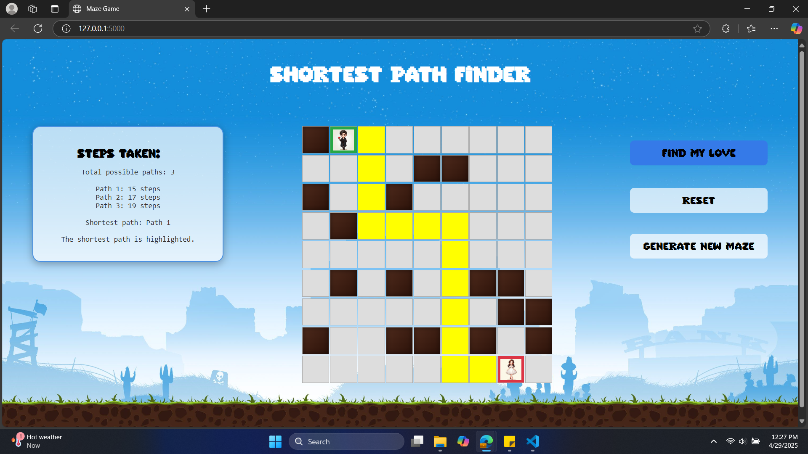

# Shortest Path Finder

 

This project was developed for the **Y3S1 Advanced Mathematics** module to demonstrate the **Dijkstra's Algorithm** for finding the shortest path between two nodes using a visual maze-based approach.


## Installation

To run the Shortest Path Finder application, you will need to have Python and Flask installed. You can install the required dependencies by running the following command:

```
pip install flask
```

## Usage

1. Start the Flask application by running the following command in your terminal:

   ```
   python app.py
   ```

2. Open your web browser and navigate to `http://localhost:5000/`. You should see the Shortest Path Finder application.

3. The application has the following features:

   - **Find My Love**: Finds the shortest path from the starting point (boy) to the ending point (girl) and animates the path.
   - **Reset**: Resets the maze and clears any highlighted paths.
   - **Generate New Maze**: Generates a new random maze with a valid path from the starting point to the ending point.

4. The application will display the number of steps taken in the shortest path and list all the possible paths found.

## API

The application exposes the following API endpoints:

- `GET /`: Renders the `index.html` template, which is the main page of the application.
- `POST /generate-maze`: Generates a new valid maze and returns it as a JSON response.
- `POST /get-path`: Finds the shortest path from the starting point to the ending point and returns the highlighted maze and the path as a JSON response.
- `POST /get-paths`: Finds multiple paths from the starting point to the ending point and returns the maze and the paths as a JSON response.

